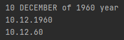

# Отчет по Учебному практическому заданию 4
  
## Задание №1.

"Разработайте класс Person для хранения даты рождения, напишите
метод toString(), разработайте метод, возвращающий строковое
представление даты рождения по вводимому в метод формату даты
(например, короткий, средний и полный формат даты).
"
  

### Структура программы:  
* Класс Person
* Класс Main
    * Тестирование
    
### Примеры работы

## Задание №2.

"Напишите код, который формирует объекты Date и Calendar по
следующим данным, вводимым пользователем:
<Год><Месяц><Число>
<Часы1
><минуты>
Напишите проверочный класс."  

### Структура программы:  
* Класс Main
    * Тестирование
* Класс MyDate
    * Класс позволяет создавать объекты, типа Date и Calendar  

## Задание №3.
"Проведите частотный анализ слов и символов из первой строки (строки
выбираются произвольно). Определите символы, которые: 
* входят и в первую и во вторую строку,
* входят в первую и не входят во вторую,
* содержатся хотя бы в одной строке.
Для обозначенных заданий осуществите вывод по следующим
параметрам:  
* символы должны выводиться в обычном порядке;
* символы должны выводиться в обратном порядке;
* символы должны выводиться в порядке возрастания циклического
сдвига влево на n разрядов хеш-функции символа."

### Структура программы:  
* Класс WordsAnalizotar
    * Основная логика
* Класс Main
    * Парсинг данных, тестирование  

## Задание №4.

"Разработайте класс, реализующий простое бинарное дерево. Реализуйте
прямой, обратный и центрированный обход дерева. Рассчитайте длину
дерева. Объясните структуру разработанных классов.
"  

### Структура программы:  
* Класс Node
    * Класс соответствующий одному узлу бинарного дерева
* Класс Tree
    * Реализация логики дерева
